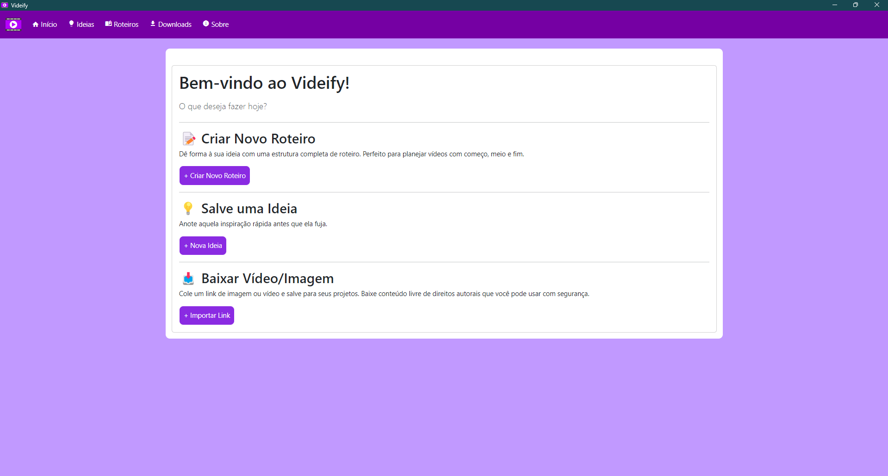
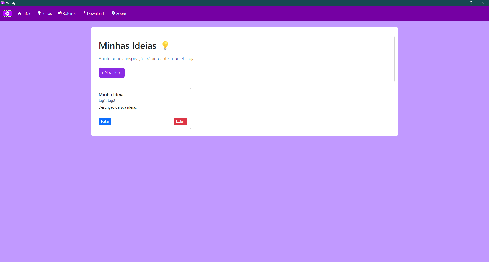
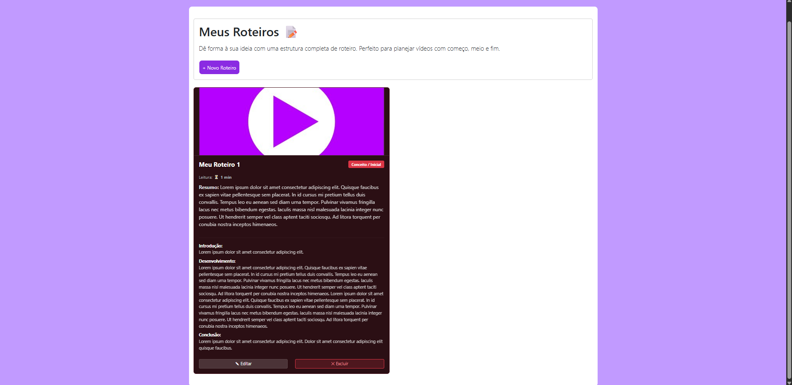
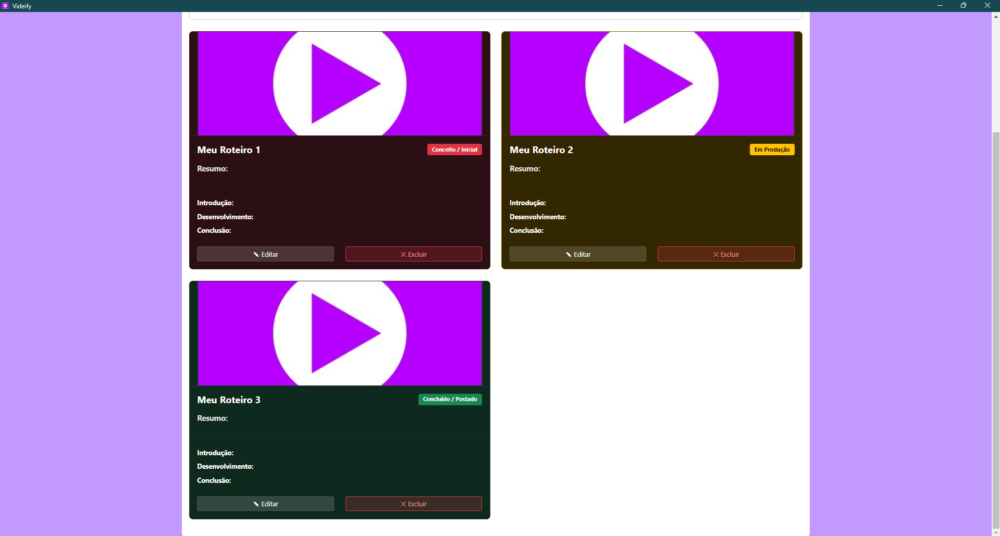
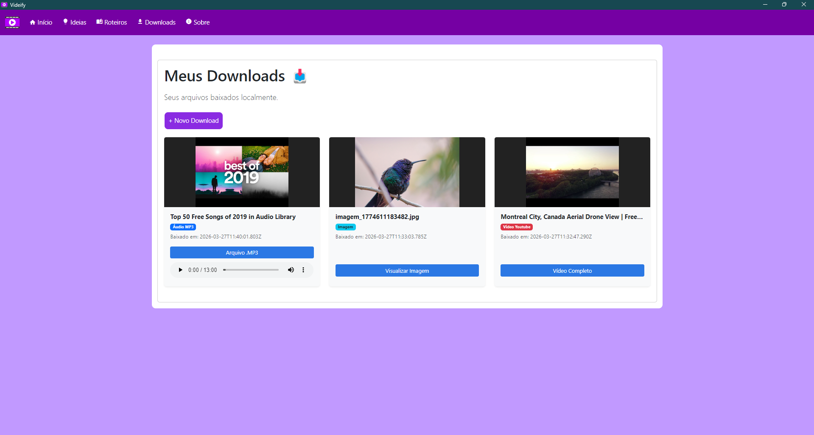
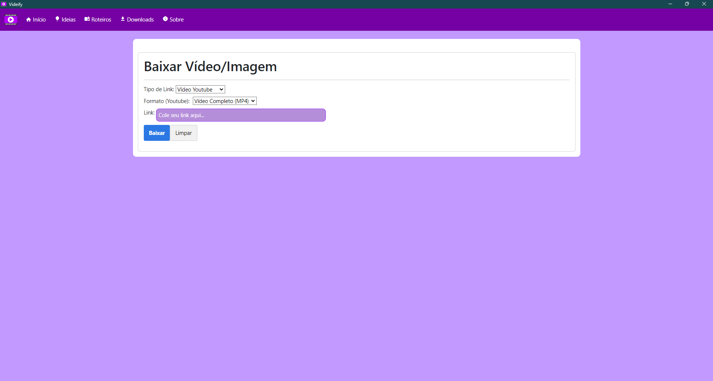

<div align="center">


# Videify

[](https://github.com/GuilhermeWilliamofc/Videify/releases)
[](https://github.com/GuilhermeWilliamofc/Videify/releases)
[](https://github.com/GuilhermeWilliamofc/Videify/blob/main/LICENSE)

</div>

[🇧🇷 Português](#-português) | [🇺🇸 English](#-english)

---

## 🇧🇷 Português

**Videify** é um aplicativo desktop projetado para criadores de conteúdo organizarem suas ideias, planejarem roteiros de vídeos completos e baixarem mídias facilmente. Tudo funciona offline, salvando os dados de forma rápida e segura localmente no seu computador.

### ✨ Principais Funcionalidades

- **Minhas Ideias:** Um espaço para anotar rapidamente inspirações de vídeos, organizando por nome, descrição longo e tags de pesquisa.
- **Meus Roteiros:** Um organizador detalhado de roteiros dividido por Introdução, Desenvolvimento e Conclusão. Inclui adição de miniatura (thumbnail) via upload de imagem local, status de produção (Conceito, Em Produção, Concluído) e cálculo automático do tempo de leitura do roteiro.
- **Meus Downloads:** Baixe vídeos (nos formatos originais) e áudios (MP3 / Opus) diretamente do YouTube pelo app de forma local e organizada sem depender de sites externos lotados de anúncios.

### 📸 Telas do Aplicativo

> 

<br>

> 

<br>

> 

<br>

> 

<br>

> 

<br>

> 

### 🛠️ Tecnologias Utilizadas

- **Frontend e Backend:** Node.js, Express, Handlebars, Vanilla CSS
- **Framework Desktop:** Electron
- **Automação de Downloads:** Python
- **Armazenamento:** Arquivos JSON Locais (Offline First) integrado à File System do computador.

### 📥 Download & Instalação

Se você não é um desenvolvedor, pode simplesmente baixar a versão compilada (**Windows .exe**) na seção de [Releases](https://github.com/GuilhermeWilliamofc/Videify/releases).

> [!IMPORTANT]
> **Antes de abrir o Videify.exe**, certifique-se de executar o arquivo `instalar_dependencias.bat` que vem junto no download.
> - Ele instalará as bibliotecas de Python necessárias para os downloads funcionarem.
> - **IMPORTANTE:** Ao instalar o Python, você **PRECISA** marcar a caixa **"Add Python to PATH"** na instalação para que o app funcione.

### 🚀 Como Executar Localmente

1. Certifique-se de ter o [Node.js](https://nodejs.org/) instalado na sua máquina.
2. Clone este repositório.
3. **Dependências do Python:** Se você não tem o Python ou a biblioteca `pytubefix` instalada, execute o arquivo `instalar_dependencias.bat`.
   - Este script verifica se o Python está no seu sistema (orientando o download caso falte) e instala o `pytubefix` automaticamente.
4. Instale as dependências do projeto executando no terminal:
   ```bash
   npm install
   ```
5. Inicie o aplicativo:
   ```bash
   npm start
   ```

---

## 🇺🇸 English

**Videify** is an all-in-one desktop application designed for content creators to organize their ideas, plan complete video scripts, and download media seamlessly. It's built to work entirely offline, saving data securely and quickly to your local machine.

### ✨ Key Features

- **My Ideas:** A dedicated space to quickly jot down video inspirations, organized by title, long descriptions, and tags.
- **My Scripts (Roteiros):** A detailed video script planner segmented into Introduction, Development, and Conclusion. It features local thumbnail image uploads, active production status tracking (Concept, In Production, Completed), and an automated script reading-time calculator.
- **My Downloads:** Locally fetch and download YouTube videos (in original formats) or audio (MP3 / Opus) neatly through the app – without relying on ad-heavy third-party websites.

### 📸 App Screenshots

> 

<br>

> 

<br>

> 

<br>

> 

<br>

> 

<br>

> 

### 🛠️ Technologies Built With

- **Frontend & Backend:** Node.js, Express, Handlebars, Vanilla CSS
- **Desktop Framework:** Electron
- **Download Engineering:** Python
- **Storage Data layer:** Local JSON Files (Offline First) mapped to your native File System.

### 📥 Download & Installation

If you are not a developer, you can simply download the compiled version (**Windows .exe**) from the [Releases](https://github.com/GuilhermeWilliamofc/Videify/releases) section.

> [!IMPORTANT]
> **Before opening Videify.exe**, make sure to run the `instalar_dependencias.bat` file included in the download.
> - It will install the necessary Python libraries for downloads to work.
> - **IMPORTANT:** When installing Python, you **MUST** check the **"Add Python to PATH"** box during installation, otherwise the app will not work.

### 🚀 How to Run Locally

1. Ensure you have [Node.js](https://nodejs.org/) installed.
2. Clone this repository to your environment.
3. **Python Dependencies:** If you don't have Python or the `pytubefix` library installed, run the `instalar_dependencias.bat` file.
   - This script checks for Python (providing download instructions if missing) and automatically installs `pytubefix`.
4. Install the project dependencies by running this in your terminal:
   ```bash
   npm install
   ```
5. Start the application via:
   ```bash
   npm start
   ```
